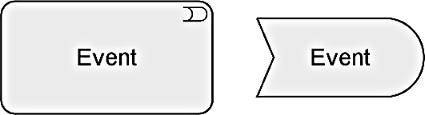

Title: EA Definitions
Date: 2021-02-13 10:19
Modified: 2010-02-13 10:19
Category: Enterprise Architecture
Tags: Enterprise Architecture, Archimate
Slug: EA Definitions
Authors: Gonzalo Sáenz
Status: published
Summary: This article covers a nuber of EA Definitions and how to model them with Archimate.

# Content
<!-- TOC -->

- [Content](#content)
- [Enterprise Architecture definition](#enterprise-architecture-definition)
- [What is enterprise architecture?](#what-is-enterprise-architecture)
- [Architecture View](#architecture-view)
- [Architecture layers](#architecture-layers)
- [Abstraction in the ArchiMate Language](#abstraction-in-the-archimate-language)
- [Archimate Metamodel](#archimate-metamodel)
  - [Active Structure Elements](#active-structure-elements)
  - [Behavior Elements](#behavior-elements)
  - [Passive Structure Elements](#passive-structure-elements)
  - [Specializations of Structure and Behavior Elements](#specializations-of-structure-and-behavior-elements)
- [Relationships](#relationships)

<!-- /TOC -->

# Enterprise Architecture definition

An Enterprise Architecture is typically developed because key people have concerns that need to be addressed by the business and IT systems within an organization. Such people are commonly referred to as the “stakeholders” of the Enterprise Architecture. The role of the architect is to address these concerns by identifying and refining the motivation and strategy expressed by stakeholders, developing an architecture, and creating views of the architecture that show how it addresses and balances stakeholder concerns. Without an Enterprise Architecture, it is unlikely that all concerns and requirements are considered and addressed.

# What is enterprise architecture?

Enterprise architecture is the process by which organizations standardize and organize IT infrastructure to aligns with business goals. These strategies support digital transformation, IT growth and the modernization of IT as a department.

[source](https://www.cio.com/article/3313657/what-is-enterprise-architecture-a-framework-for-transformation.html)

# Architecture View

A representation of a system from the perspective of a related set of concerns.

# Architecture layers

1. The Business Layer depicts business services offered to customers, which are realized in the organization by business processes performed by business actors.

2. The Application Layer depicts application services that support the business, and the applications that realize them.

3. The Technology Layer depicts technology services such as processing, storage, and communication services needed to run the applications, and the computer and communication hardware and system software that realize those services. Physical elements are included for modeling physical equipment, materials, and distribution networks to this layer.

In alignment with service-orientation, the most important relationship between layers is formed by “***serving***”relationships, which show how the elements in one layer are served by the services of other layers. (Note, however, that services need not only serve elements in another layer, but also can serve elements in the same layer.) A second type of link is formed by **realization** relationships: elements in lower layers may realize comparable elements in higher layers; e.g., a “data object” (Application Layer) may realize a “business object” (Business Layer); or an “artifact” (Technology Layer) may realize either a “data object” or an “application component” (Application Layer).

The general structure of models within the different layers is similar. The same types of elements and relationships are used, although their exact nature and granularity differ.

The dimensions of the framework are as follows:

* Layers – the three levels at which an enterprise can be modeled in ArchiMate:
  * Business,
  * Application,
  * and Technology (as described above)
* Aspects:
   * The *Active Structure Aspect*, which represents the structural elements (the business actors, application components, and devices that display actual behavior; i.e., the “*subjects*” of activity)
   * The *Behavior Aspect*, which represents the behavior (processes, functions, events, and services) performed by the actors; structural elements are assigned to behavioral elements, to show *who* or *what* displays the behavior
    * The *Passive Structure Aspect*, which represents the objects on which behavior is performed; these are usually information objects in the Business Layer and data objects in the Application Layer, but they may also be used to represent physical objects

ArchiMate models colors are used to distinguish between the layers of the ArchiMate Core Framework, as follows:

* Yellow for the Business Layer

* Blue for the Application Layer

* Green for the Technology Layer

The standard notation also uses a convention with the shape of the corners of its symbols for different element types, as follows:

* Square corners are used to denote structure elements

* Round corners are used to denote behavior elements

* Diagonal corners are used to denote motivation elements

# Abstraction in the ArchiMate Language

First, the distinction between an external and internal view is common in systems design. The *external* view depicts what the system has to do for its environment, while the *internal* view depicts how it does this.

Second, the distinction between *behavior* and *active* structure is commonly used to separate what the system must do and how the system does it from the system constituents (people, applications, and infrastructure) that do it.

A third distinction is between conceptual, logical, and physical abstraction levels. This has its roots in data modeling: *conceptual* elements represent the information the business finds relevant; *logical* elements provide logical structure to this information for manipulation by information systems; *physical* elements describe the storage of this information.

# Archimate Metamodel
This generic metamodel fragment consists of two main types of elements: structure (“nouns”) and behavior elements (“verbs”).

*Structure* elements can be subdivided into active structure elements and passive structure elements. Active structure elements can be further subdivided into external active structure elements (also called interfaces) and internal active structure elements.

*Behavior* elements can be subdivided into internal behavior elements, external behavior elements (also called services), and events.

These three aspects – active structure, behavior, and passive structure – have been inspired by natural language, where a sentence has a subject (active structure), a verb (behavior), and an object (passive structure).

## Active Structure Elements

*Active* structure elements are the subjects that can perform behavior.

An *internal active* structure element represents an entity that is capable of performing behavior.

An *external active* structure element, called an interface, represents a point of access where one or more services are provided to the environment.

## Behavior Elements

Behavior elements represent the dynamic aspects of the enterprise.

An internal behavior element represents a unit of activity that can be performed by one or more active structure elements.

An external behavior element, called a service, represents an explicitly defined exposed behavior.

Thus, a service is the externally visible behavior of the providing system, from the perspective of systems that use that service; the environment consists of everything outside this providing system. The value offered to the user of the service provides the motivation for the existence of the service. For the users, only this exposed behavior and value, together with non-functional aspects such as the quality of service, costs, etc., are relevant. These can be specified in a contract or Service-Level Agreement (SLA). Services are accessible through interfaces.

In addition to this, a third type of behavior element is defined to denote an event that can occur; for example, to signal a state change.

An event represents a state change.

An event may have a time attribute that indicates the moment or moments at which the event happens. For example, this can be used to model time schedules.

## Passive Structure Elements

A passive structure element represents an element on which behavior is performed.

## Specializations of Structure and Behavior Elements

For individual internal behavior elements, a distinction is made between processes and functions.

A **process** represents a sequence of behaviors that achieves a specific result.

A **function** represents a collection of behavior based on specific criteria, such as required resources, competencies, or location.

The collective nature of a behavior can be made either implicit (several active structure elements assigned to the same internal behavior via an *and* junction) or explicit through the use of a collective *internal behavior* (interaction) that is performed by (a collaboration of) multiple active structure elements.

A **collaboration** represents an aggregate of two or more internal active structure elements, working together to perform some collective behavior.

An **interaction** represents a unit of collective behavior that must be performed by two or more internal active structure elements, either assigned directly or aggregated in a collaboration.

## Summary of Structure and Behaviour Structures

Core Elements

| Element                                        | Specializations                                              | Definition                                                   | Notation                                                     |
| ---------------------------------------------- | ------------------------------------------------------------ | ------------------------------------------------------------ | ------------------------------------------------------------ |
| Active  Structure                              |                                                              |                                                              |                                                              |
| Internal active structure element              | Represents an entity that is capable of  performing behavior. |  |                                                              |
|                                                | Collaboration                                                | Represents an aggregate of two or more internal  active structure elements, working together to perform some collective  behavior. |  |
| Interface (external active structure  element) | Represents a point of access where one or  more services are exposed to the environment. |  |                                                              |
| Behavior                                       |                                                              |                                                              |                                                              |
| Internal behavior element                      | Represents a unit of activity that can be  performed by one or more active structure elements. |  |                                                              |
|                                                | Process                                                      | Represents a sequence of behaviors that  achieves a specific result. |  |
|                                                | Function                                                     | Represents a collection of behavior based  on specific criteria, such as required resources, competencies, or location. |  |
|                                                | Interaction                                                  | Represents a unit of collective behavior  that must be performed by two or more internal active structure elements, either  assigned directly or aggregated in a collaboration. |  |
| Service (external behavior element)            | Represents an explicitly defined exposed  behavior.          |                                   |                                                              |
| Event                                          | Represents a state change.                                   |  |                                                              |
| Passive  Structure                             |                                                              |                                                              |                                                              |
| Passive structure element                      | Represents an element on which behavior  is performed.       |  |                                                              |

# Motivation Elements

The core elements of the ArchiMate language focus on describing the architecture of systems that support the enterprise. They do not cover the elements which, in different ways, *drive* the design and operation of the enterprise. These motivation aspects correspond to the “Why” column of the Zachman framework

Several *motivation elements* are included in the language: stakeholder, value, meaning, driver, assessment, goal, outcome, principle, and requirement, which in turn has constraint as a subtype.

The motivation elements address the way the Enterprise Architecture is aligned to its context, as described by these intentions.

A motivation element represents the context of or reason behind the architecture of an enterprise.

# Composite Elements

Composite elements consist of other concepts, possibly from multiple aspects or layers of the language. Grouping and location are generic composite elements

## Grouping

The grouping element aggregates or composes concepts that belong together based on some common characteristic.

## Location

A location represents a conceptual or physical place or position where concepts are located (e.g., structure elements) or performed (e.g., behavior elements).

The location element is used to model the places where (active and passive) structure elements such as business actors, application components, and devices are located. This is modeled by means of an aggregation relationship from a location to structure element. A location can also aggregate a behavior element, to indicate where the behavior is performed.

# Relationships

Relationships are classified as follow:

* *Structural* relationships, which model the static construction or composition of concepts of the same or different types

* *Dependency* relationships, which model how elements are used to support other elements

* *Dynamic* relationships, which are used to model behavioral dependencies between elements

* *Other* relationships, which do not fall into one of the above categories

## Summary of Relationshipts

Relationships

| Structural  Relationships | Notation                                                     | Role Names              |                                                         |
| ------------------------- | ------------------------------------------------------------ | ----------------------- | ------------------------------------------------------- |
| Composition               | Represents that an element consists of  one or more other concepts. |    | ←  composed of   →  composed in                         |
| Aggregation               | Represents that an element combines one  or more other concepts. |    | ← aggregates   → aggregated  in                         |
| Assignment                | Represents the allocation of  responsibility, performance of behavior, storage, or execution. |    | ← assigned  to   → has  assigned                        |
| Realization               | Represents that an entity plays a  critical role in the creation, achievement, sustenance, or operation of a  more abstract entity. |    | ← realizes   → realized  by                             |
| Dependency Relationships  | Notation                                                     | Role Names              |                                                         |
| Serving                   | Represents that an element provides its  functionality to another element. |    | ← serves   → served  by                                 |
| Access                    | Represents the ability of behavior and  active structure elements to observe or act upon passive structure elements. |    | ← accesses   → accessed  by                             |
| Influence                 | Represents that an element affects the  implementation or achievement of some motivation element. |  | ← influences   → influenced  by                         |
| Association               | Represents an unspecified relationship,  or one that is not represented by another ArchiMate relationship. |    | associated with   ← associated  to   → associated  from |
| Dynamic Relationships     | Notation                                                     | Role Names              |                                                         |
| Triggering                | Represents a temporal or causal relationship  between elements. |    | ← triggers   → triggered  by                            |
| Flow                      | Represents transfer from one element to  another.            |    | ← flows  to   → flows  from                             |
| Other Relationships       | Notation                                                     | Role Names              |                                                         |
| Specialization            | Represents that an element is a particular  kind of another element. |    | ← specializes   → specialized  by                       |
| Relationship  Connectors  | Notation                                                     | Role Names              |                                                         |
| Junction                  | Used to connect relationships of the same  type.             |    |                                                         |
