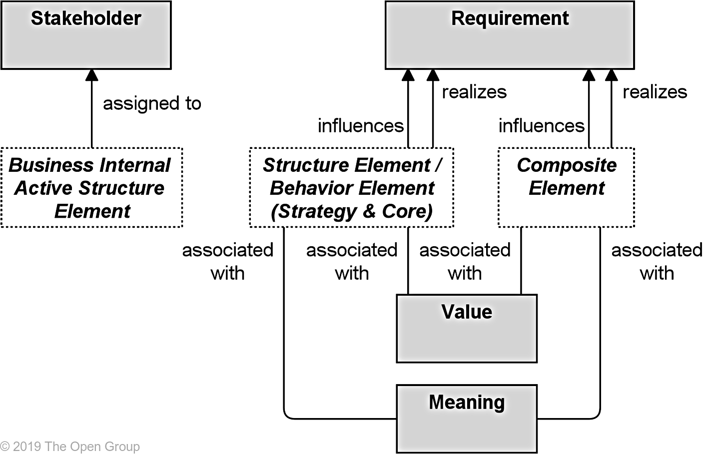

Title: Motivation Elements
Date: 2021-02-13 10:18
Modified: 2010-02-13 10:18
Category: Enterprise Architecture
Tags: Enterprise Architecture, Archimate
Slug: Motivation Elements
Authors: Gonzalo Sáenz
Status: published
Summary: Motivation Elements

# Motivation Elements

## Summary of Motivation Elements

| Element     | Definition                                                   | Notation                                                     |
| ----------- | ------------------------------------------------------------ | ------------------------------------------------------------ |
| Stakeholder | Represents the role of an individual,  team, or organization (or classes thereof) that represents their interests in  the effects of the architecture. |       |
| Driver      | Represents an external or internal  condition that motivates an organization to define its goals and implement the  changes necessary to achieve them. |       |
| Assessment  | Represents the result of an analysis of  the state of affairs of the enterprise with respect to some driver. |       |
| Goal        | Represents a high-level statement of  intent, direction, or desired end state for an organization and its  stakeholders. |       |
| Outcome     | Represents an end result.                                    |       |
| Principle   | Represents a statement of intent defining  a general property that applies to any system in a certain context in the architecture. |       |
| Requirement | Represents a statement of need defining a  property that applies to a specific system as described by the architecture. |  |
| Constraint  | Represents a factor that limits the  realization of goals.   |  |
| Meaning     | Represents the knowledge or expertise  present in, or the interpretation given to, a concept in a particular  context. |  |
| Value       | Represents the relative worth, utility,  or importance of a concept. |  |

## Relationships with Core Elements

The purpose of the motivation elements is to model the motivation behind the core elements in an Enterprise Architecture. Therefore, it should be possible to relate motivation elements to core elements.

