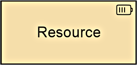
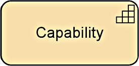
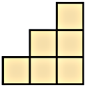
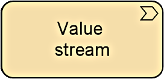
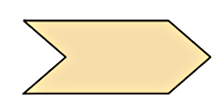
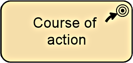
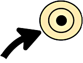

Title: Strategy Elements
Date: 2021-02-13 10:17
Modified: 2010-02-13 10:17
Category: Enterprise Architecture
Tags: Enterprise Architecture, Archimate
Slug: Strategy Elements
Authors: Gonzalo Sáenz
Status: published
Summary: Strategy Elements
# Strategy Elements

Table 5: Strategy Elements

| Element          | Description                                                  | Notation                                                  |
| ---------------- | ------------------------------------------------------------ | --------------------------------------------------------- |
| Resource         | Represents an asset owned or controlled  by an individual or organization. |     |
| Capability       | Represents an ability that an active  structure element, such as an organization, person, or system, possesses. |     |
| Value stream     | Represents a sequence of activities that  create  an overall result for a customer, stakeholder, or end user. |     |
| Course of action | Represents an approach or plan for  configuring some capabilities and resources of the enterprise, undertaken to  achieve a goal. |     |
