Title: Business Layer
Date: 2021-02-13 10:16
Modified: 2010-02-13 10:16
Category: Enterprise Architecture
Tags: Enterprise Architecture, Archimate
Slug: Business Layer
Authors: Gonzalo Sáenz
Status: published
Summary: Business Layer
# Business Layer

Table 6: Business Layer Elements

| Element                | Description                                                  | Notation                    |
| ---------------------- | ------------------------------------------------------------ | --------------------------- |
| Business actor         | Represents a business entity that is  capable of performing behavior. | 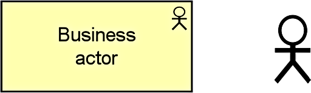 |
| Business role          | Represents the responsibility for  performing specific behavior, to which an actor can be assigned, or the part an  actor plays in a particular action or event. | 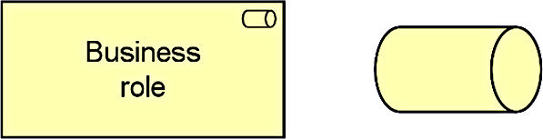 |
| Business collaboration | Represents an aggregate of two or more business  internal active structure elements that work together to perform collective  behavior. | 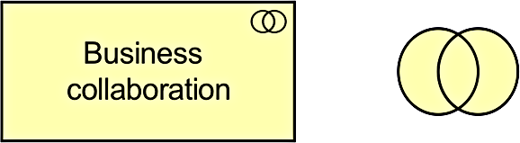 |
| Business interface     | Represents a point of access where a  business service is made available to the environment. | 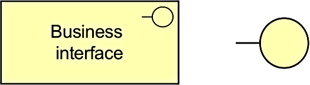 |
| Business process       | Represents a sequence of business  behaviors that achieves a specific result such as a defined set of products  or business services. | 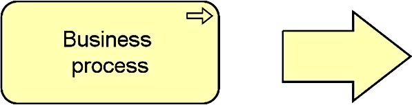 |
| Business function      | Represents a collection of business behavior  based on a chosen set of criteria (typically required business resources  and/or competencies), closely aligned to an organization, but not necessarily  explicitly governed by the organization. | 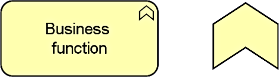 |
| Business interaction   | Represents a unit of collective business behavior  performed by (a collaboration of) two or more business actors, business roles,  or business collaborations. | 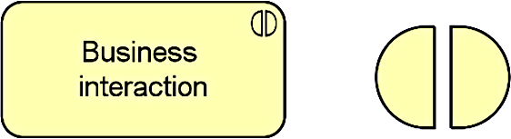 |
| Business event         | Represents an organizational state change.                   | 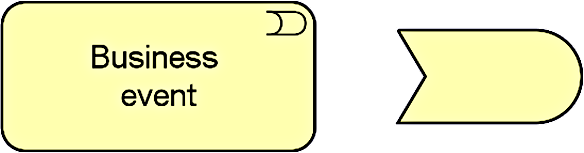 |
| Business service       | Represents explicitly defined behavior  that a business role, business actor, or business collaboration exposes to  its environment. | 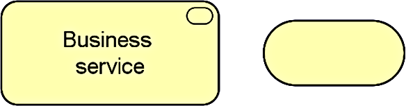 |
| Business object        | Represents a concept used within a  particular business domain. | 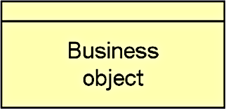 |
| Contract               | Represents a formal or informal  specification of an agreement between a provider and a consumer that  specifies the rights and obligations associated with a product and establishes  functional and non-functional parameters for interaction. | 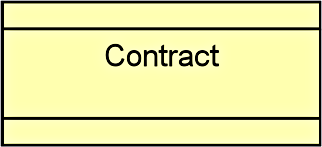 |
| Representation         | Represents a perceptible form of the  information carried by a business object. | 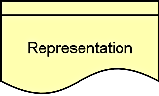 |
| Product                | Represents a coherent collection of  services and/or passive structure elements, accompanied by a contract/set of  agreements, which is offered as a whole to (internal or external) customers. | 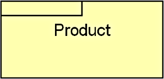 |
