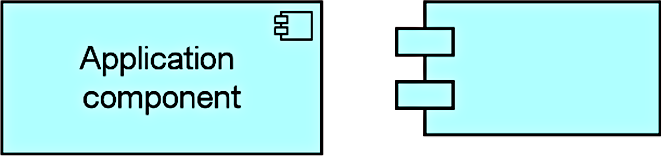
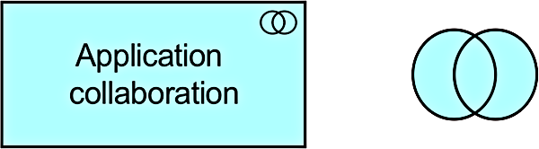
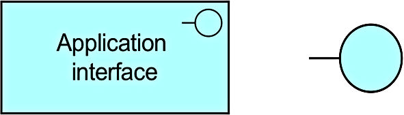
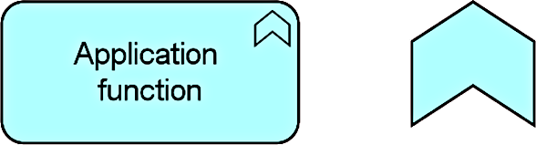
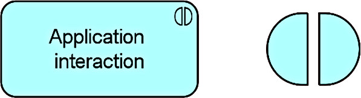
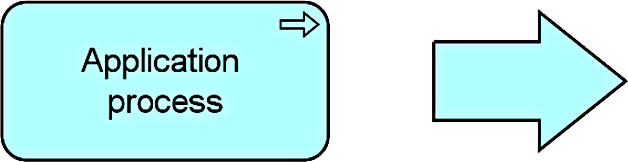
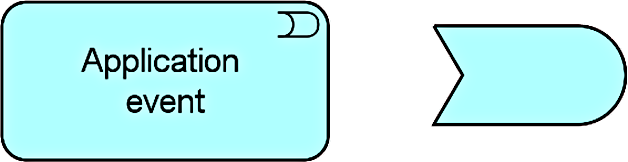
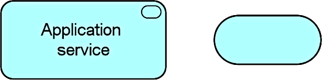
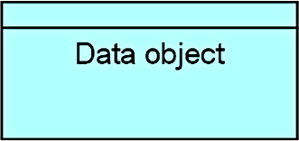

Title: Application Layer
Date: 2021-02-13 10:15
Modified: 2010-02-13 10:15
Category: Enterprise Architecture
Tags: Enterprise Architecture, Archimate
Slug: Application Layer
Authors: Gonzalo Sáenz
Status: published
Summary: Application Layer

# Application Layer

## Summary of Application Layer Elements

Table 7: Application Layer Elements

| Element                   | Definition                                                   | Notation                    |
| ------------------------- | ------------------------------------------------------------ | --------------------------- |
| Application component     | Represents an encapsulation of  application functionality aligned to implementation structure, which is  modular and replaceable. |  |
| Application collaboration | Represents an aggregate of two or more  application internal active structure elements that work together to perform  collective application behavior. |  |
| Application interface     | Represents a point of access where  application services are made available to a user, another application  component, or a node. |  |
| Application function      | Represents automated behavior that can be  performed by an application component. |  |
| Application interaction   | Represents a unit of collective  application behavior performed by (a collaboration of) two or more  application components. |  |
| Application process       | Represents a sequence of application  behaviors that achieves a specific result. |  |
| Application event         | Represents an application state change.                      |  |
| Application service       | Represents an explicitly defined exposed  application behavior. |  |
| Data object               | Represents data structured for automated  processing.        |  |
