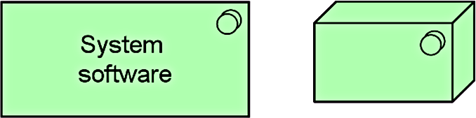
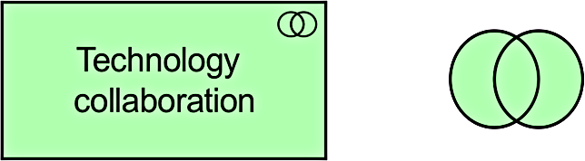
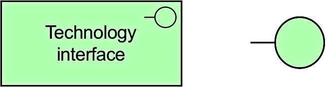
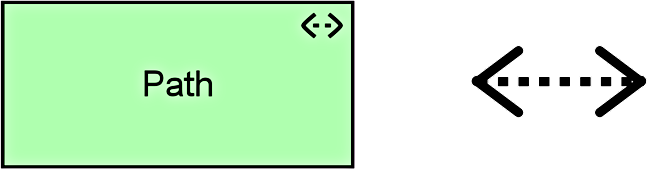
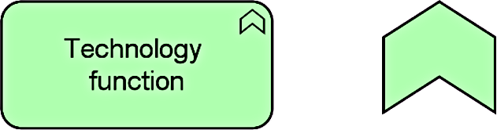
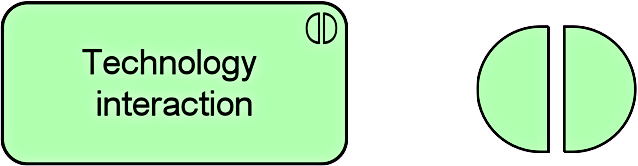
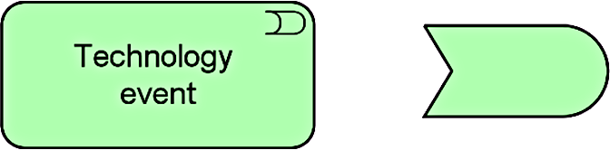
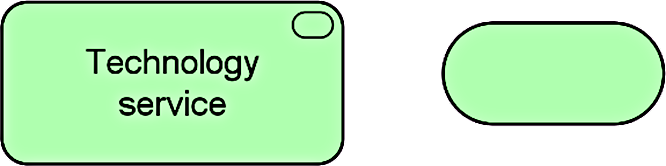

Title: Technology Layer
Date: 2021-02-13 10:14
Modified: 2010-02-13 10:14
Category: Enterprise Architecture
Tags: Enterprise Architecture, Archimate
Slug: Technology Layer
Authors: Gonzalo Sáenz
Status: published
Summary: Technology Layer

# Technology Layer

## Technology Layer Elements

| Element                  | Definition                                                   | Notation                    |
| ------------------------ | ------------------------------------------------------------ | --------------------------- |
| Node                     | Represents a computational or physical  resource that hosts, manipulates, or interacts with other computational or  physical resources. |  |
| Device                   | Represents a physical IT resource upon  which system software and artifacts may be stored or deployed for execution. |  |
| System software          | Represents software that provides or  contributes to an environment for storing, executing, and using software or  data deployed within it. |  |
| Technology collaboration | Represents an aggregate of two or more technology  internal active structure elements that work together to perform collective technology  behavior. |  |
| Technology interface     | Represents a point of access where technology  services offered by a node can be accessed. |  |
| Path                     | Represents a link between two or more  nodes, through which these nodes can exchange data, energy, or material. |  |
| Communication network    | Represents a set of structures that  connects nodes for transmission, routing, and reception of data. |  |
| Technology function      | Represents a collection of technology behavior  that can be performed by a node. |  |
| Technology process       | Represents a sequence of technology  behaviors that achieves a specific result. |  |
| Technology interaction   | Represents a unit of collective  technology behavior performed by (a collaboration of) two or more nodes. |  |
| Technology event         | Represents a technology state change.                        |  |
| Technology service       | Represents an explicitly defined exposed  technology behavior. |  |
| Artifact                 | Represents a piece of data that is used  or produced in a software development process, or by deployment and operation  of an IT system. |  |
