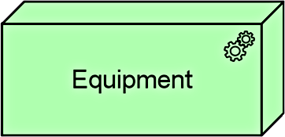
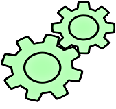
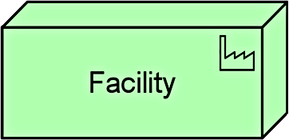
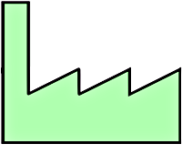
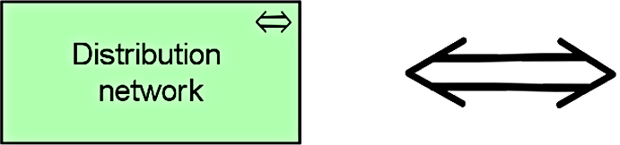
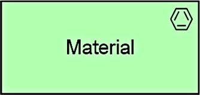

Title: Physical Level
Date: 2021-02-13 10:13
Modified: 2010-02-13 10:13
Category: Enterprise Architecture
Tags: Enterprise Architecture, Archimate
Slug: Physical Level
Authors: Gonzalo Sáenz
Status: published
Summary: Physical Level

# Physical Level

## Physical Elements

| Element              | Definition                                                   | Notation                                                     |
| -------------------- | ------------------------------------------------------------ | ------------------------------------------------------------ |
| Equipment            | Represents one or more physical machines,  tools, or instruments that can create, use, store, move, or transform  materials. |        |
| Facility             | Represents a physical structure or  environment.             |        |
| Distribution network | Represents a physical network used to transport  materials or energy. |                                   |
| Material             | Represents tangible physical matter or energy.               |        |
