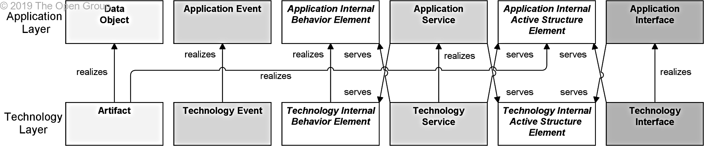

Title: Relationships Between Core Layers
Date: 2021-02-13 10:12
Modified: 2010-02-13 10:12
Category: Enterprise Architecture
Tags: Enterprise Architecture, Archimate
Slug: Relationships Between Core Layers
Authors: Gonzalo Sáenz
Status: published
Summary: Relationships Between Core Layers

# Relationships Between Core Layers

The figure bellow shows the relationships between the Business Layer, the Application Layer, and the Technology Layer elements. There are two main types of relationships between these layers:

* *Serving* relationships; for example, between application service and the different types of business behavior elements, and between application interface and business role; *vice versa*, serving relationships between business service and application behavior elements, and between business interface and application component. These relationships represent the behavioral and structural aspects of the support of the business by applications.

* *Realization* relationships; for example, from an application process or function to a business process or function, or from a data object or a technology object to a business object, to indicate that the data object is a digital representation of the corresponding business object, or the technology object is a physical representation of the business object.

In addition, there may be an aggregation relationship between a product and an application or technology service, and a data or technology object, to indicate that these services or objects can be offered directly to a customer as part of the product.

## Alignment of the Application and Technology Layers

There are two types of relationships between *Application Layer* and *Technology Layer* elements:

* *Serving* relationships, between technology service and the different types of application behavior elements, and between technology interface and application component; *vice versa*, serving relationships between application service and technology behavior, and application interface and node. These relationships represent the behavioral and structural aspects of the use of technology infrastructure by applications and *vice versa*.

* *Realization* relationships from technology process or function to application process or function, from technology object to data object, to indicate that the data object is realized by, for example, a physical data file, from technology object to application component, to indicate that a physical data file is an executable that realizes an application or part of an application. (Note: In this case, an artifact represents a “physical” component that is deployed on a node; this is modeled with an assignment relationship. A (logical) application component is realized by an artifact and, indirectly, by the node on which the artifact is deployed.)

## Example of relationships across layers

