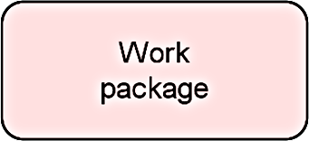
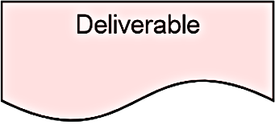
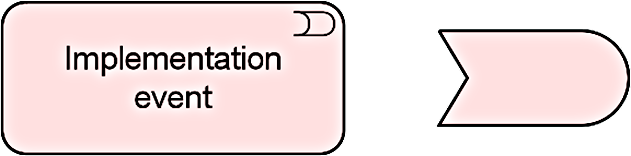
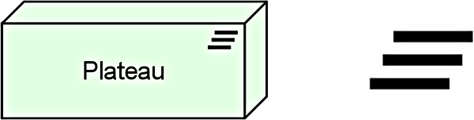
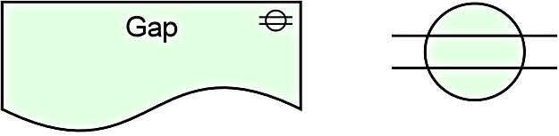
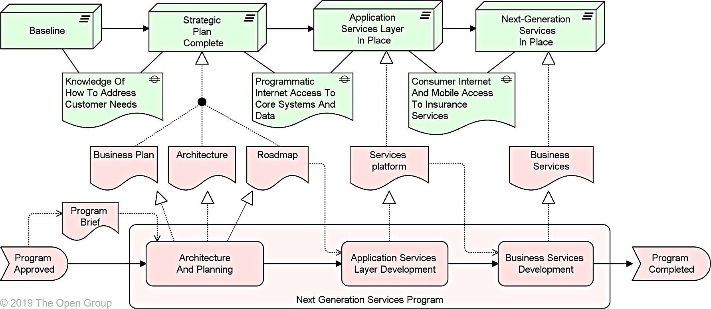
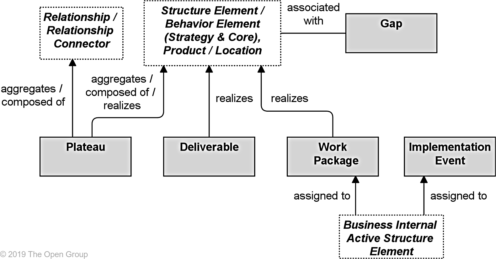

Title: Implementation and Migration Elements
Date: 2021-02-13 10:11
Modified: 2010-02-13 10:11
Category: Enterprise Architecture
Tags: Enterprise Architecture, Archimate
Slug: Implementation and Migration Elements
Authors: Gonzalo Sáenz
Status: published
Summary: Implementation and Migration Elements
# Implementation and Migration Elements

## Implementation and Migration Elements

| Element              | Definition                                                   | Notation                    |
| -------------------- | ------------------------------------------------------------ | --------------------------- |
| Work package         | Represents a series of actions identified  and designed to achieve specific results within specified time and resource  constraints. |  |
| Deliverable          | Represents a precisely-defined result of  a work package.    |  |
| Implementation event | Represents a state change related to  implementation or migration. |  |
| Plateau              | Represents a relatively stable state of  the architecture that exists during a limited period of time. |  |
| Gap                  | Represents a statement of difference  between two plateaus.  |  |

## Example

## Relationships with Other Aspects and Layers

