Title: Summary of Archimate Language Notation
Date: 2021-02-13 10:10
Modified: 2010-02-13 10:10
Category: Enterprise Architecture
Tags: Enterprise Architecture, Archimate
Slug: Summary of Language Notation
Authors: Gonzalo Sáenz
Status: published
Summary: Summary of Archimate Language Notation
# Summary of Archimate Language Notation

## 1) Core Elements

## 2) Motivation, Strategy, Implementation and Migration Elements

## 3) Relationships

# Archimate model

|                                            | Passive Structure                                            | Behaviour                                                    | Active Structure                                             | Motivation |
| ------------------------------------------ | ------------------------------------------------------------ | ------------------------------------------------------------ | ------------------------------------------------------------ | ---------- |
| Strategy                                   |                                   | 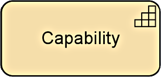 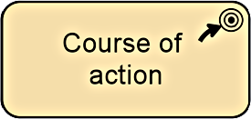      |                                                              |            |
| Business                                   | 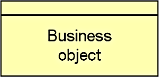 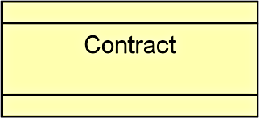  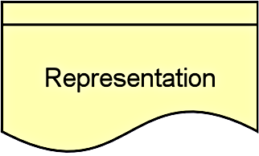 | 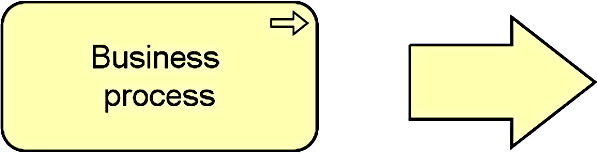   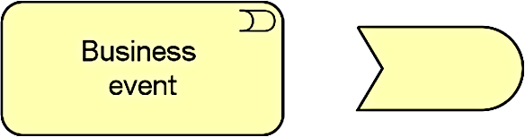  |  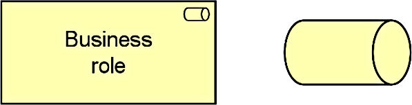  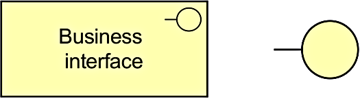 |            |
| Application                                | 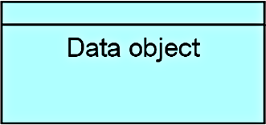                                  | 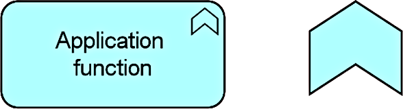    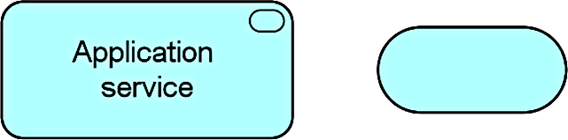 | 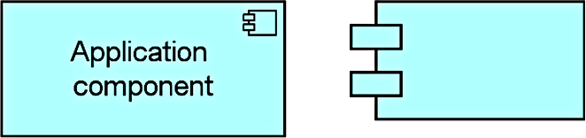   |            |
| Technology                                 |                                   |     |        |            |
| Physical                                   | 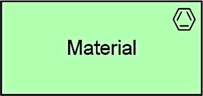                                  |                                                              | 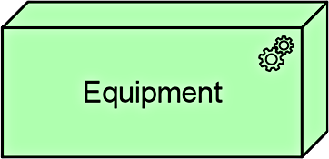 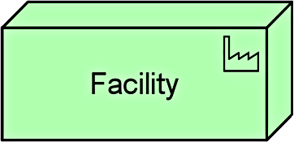 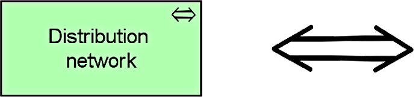 |            |
| Implementation 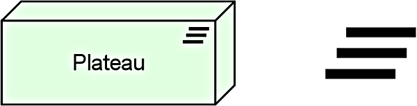 |  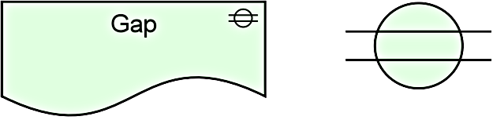      | 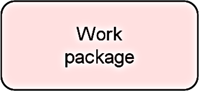 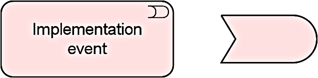      |                                                              |            |
|                                            |                                                              |                                                              |                                                              |            |
