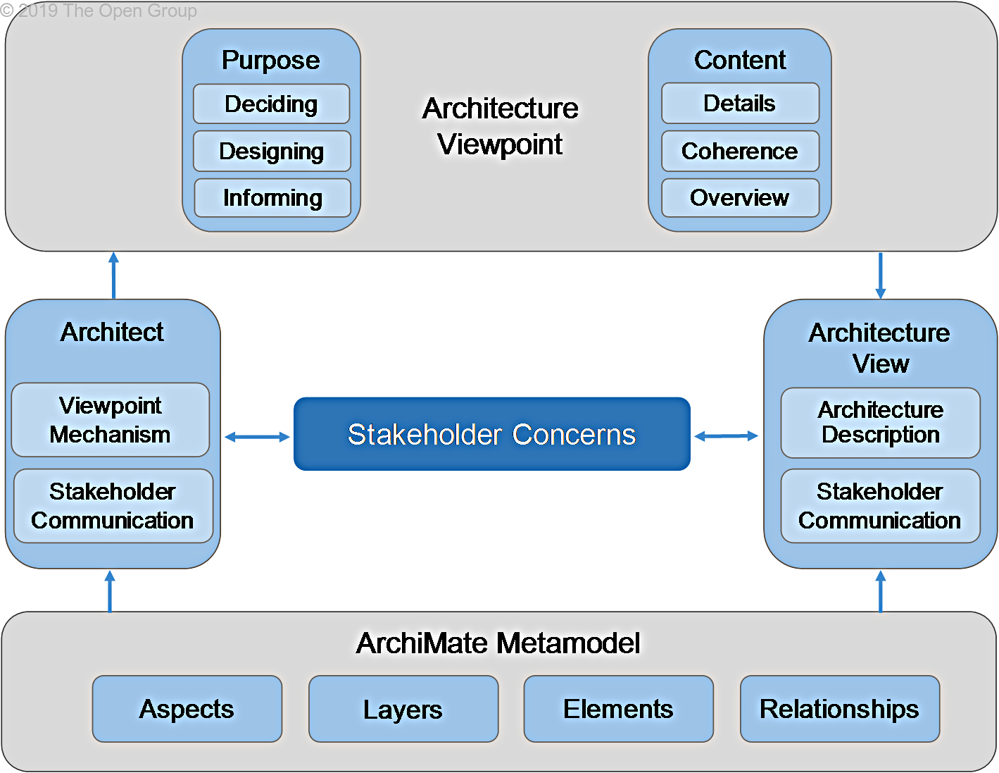

Title: Stakeholders, Architecture Views, and Viewpoints
Date: 2021-02-13 10:09
Modified: 2010-02-13 10:09
Category: Enterprise Architecture
Tags: Enterprise Architecture, Archimate
Slug: Stakeholders Architecture Views and Viewpoints
Authors: Gonzalo Sáenz
Status: published
Summary: Stakeholders, Architecture Views, and Viewpoints
# Stakeholders, Architecture Views, and Viewpoints

## Viewpoint Mechanism

An architect is confronted with many different types of stakeholders and concerns. To help in selecting the right viewpoints for the task at hand, we introduce a framework for the definition and classification of viewpoints: the *viewpoint mechanism*. The framework is based on two dimensions: *purpose* and *content*.

Creating an ArchiMate viewpoint consists of two steps:

1. Selecting a subset of relevant concepts (elements and relationships) from the ArchiMate metamodel, based on the information that is needed to address the stakeholder’s concerns.

2. Defining a representation to depict these concepts in a way that is understood by the stakeholders. This can be a diagram that uses standard or customized ArchiMate notation, a catalog of elements, a matrix showing the relationships between two groups of elements, or an entirely different visualization.

Applying this viewpoint to an architecture model means that those parts of the architecture are selected that match the chosen set of concepts (Step 1) and are depicted in the manner prescribed by Step 2.

## Defining and Classifying Viewpoints

To help define and classify viewpoints based on a repeatable structure, the ArchiMate language assists the architect in selecting *purpose* and *content* relevant for the stakeholder’s concerns.

The *purpose* dimension is supported by the following three categories:

* *Designing*: design viewpoints support architects and designers in the design process from initial sketch to detailed design

  Typically, design viewpoints consist of diagrams like those used in, for example, UML.

* *Deciding*: decision support viewpoints assist managers in the process of decision-making by offering insight into cross-domain architecture relationships, typically through projections and intersections of underlying models, but also by means of analytical techniques

  Typical examples are cross-reference tables, landscape maps, lists, and reports.

* *Informing*: informing viewpoints help to inform any stakeholder about the Enterprise Architecture, in order to achieve understanding, obtain commitment, and convince adversaries

  Typical examples are illustrations, animations, cartoons, flyers, etc.

The *content* dimension uses the ArchiMate Core Framework to select relevant aspects and layers. This is supported by the following three categories:

* *Details*: views on the detailed level typically consider one layer and one aspect from the ArchiMate Core Framework

  Typical stakeholders are a software engineer responsible for design and implementation of a software component or a process owner responsible for effective and efficient process execution.

* *Coherence*: at the coherence abstraction level, multiple layers or multiple aspects are spanned

  Extending the view to more than one layer or aspect enables the stakeholder to focus on architecture relationships like process-uses-system (multiple layer) or application-uses-object (multiple aspect). Typical stakeholders are operational managers responsible for a collection of IT services or business processes.

* *Overview*: the overview abstraction level addresses both multiple layers and multiple aspects

  Typically, such overviews are addressed to Enterprise Architects and decision-makers, such as CEOs and CIOs.
